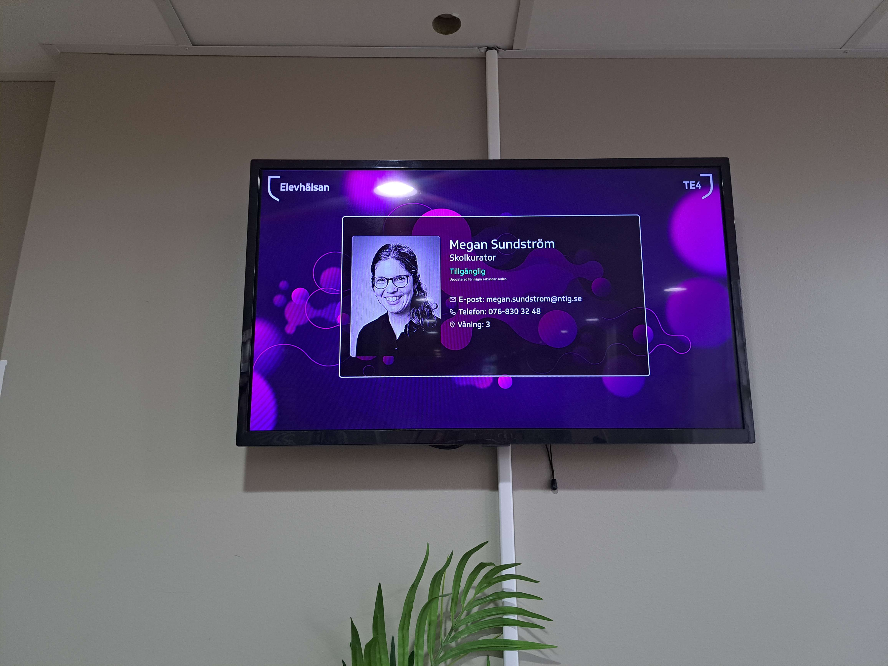

# Student Health Staff Monitor

## Table of Contents

- [Introduction](README.md#introduction)
- [How To Change The Information Currently Displayed](README.md#how-to-change-the-information-currently-displayed)
- [Google Drive Folder](README.md#google-drive-folder)
- [Documentation](README.md#Documentation)
- [Definition of Done](README.md#definition-of-done)
- [Creating branches & Merging to main](README.md#creating-branches--merging-to-main)
- [Development Environment](README.md#development-environment)
- [Programming Languages & Frameworks](README.md#Programming-Languages-&-Frameworks)
  - [Programming Languages](README.md#programming-languages)
  - [Frameworks](README.md#frameworks)
  - [Static Site Generator](README.md#static-site-generator)
  - [Python & Javascript](README.md#python--javascript)

## Introduction

This project aims to create a digital sign system that highlights Student Health Staff, providing quick and engaging information about their availability and services.

## How To Change The Information Currently Displayed

Changing the information that is displayed on the monitor is done by changing the information in [this Google spreadsheet](https://docs.google.com/spreadsheets/d/1qY1KYAY-AjFh2DWsjiVwOVj2qqJ29kpSs_YaBHi-TEs). The data on the monitor will update automatically from a couple of seconds up to a few minutes after you edit the spreadsheet.

### Adding an Image

Select the cell for the person you want to add an image to in the "BILD" column. Click `Insert` -> `Image` -> `Insert image in cell`.
Then click on `Browse` and select the image you want to add.

## Google Drive Folder

This project has a [Google Drive folder](https://drive.google.com/drive/folders/1PE9KzvEw8aPh5E4z1SYBZf03GJ8k5gWZ) for private data. The folder contains the spreadsheet for displayed data, product backlog, passwords and more.

## Documentation

The [documentation](documentation.md) should be written in English.

## Definition of Done

https://docs.google.com/document/d/1oLyPqJwN76pdIZRc8FyYE1W91b1bqy2K/edit

## Creating branches & Merging to main

- For every feature added, a branch should be made for the feature.
- After a feature is created and follows the Definition of Done above, create a pull request to merge it with the main branch.
- Discuss the pull request with your group members and go through any changes that need to be made.
- After the changes have been finalized and completed, a group member can then approve and merge the pull request, marking the feature as successfully implemented. 

## Development Environment

- [How to set up a development environment](documentation.md#set-up-development-environment)
- **Editor** - Visual Studio Code
- **Remote** - SSH extension
- **Version Control Host** - GitHub
- **OS** - Windows 10
- **svg Editor** - Inkscape

## Programming Languages & Frameworks

### Programming Languages

- HTML5
- CSS3
- Python3
- JavaScript V8

### Frameworks

- Bootstrap 3.4.1
- JQuery 3.6.0

### Static Site Generator

- Jekyll 4.3.2 (Installed on Ruby 3.0.2)

### Python & JavaScript

- Variables and functions use snake_case
- Indentations are 4 spaces (or one tab default in Visual Studio Code)
- Ensure that there is a space between comments and the '#' or '//'.
- A line of code should be maximum of 70-80 characters long.
